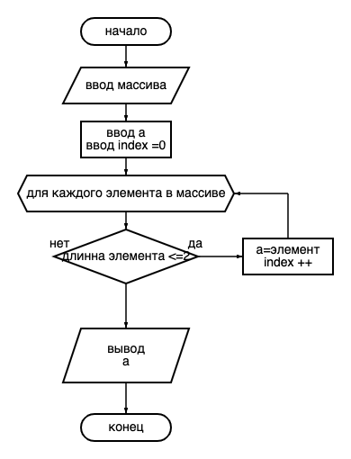

## Блок-схема

## Описание кода
Создаем массив, берем на ввод тип string, так как элементы массива являются набором символов.

Далее вводим переменную *result*, которая будет перезаписывать наш массив. Так же задаем значение индекса *i* равного 0. Для этих переменный воспульзуемся неявной типизацией ввода данных. 

После воспользуемся циклом *foreach*, который к каждому элементу массива применит условие размера <=2, при выполнении которого переменная запишется в наш новый массив *result*, и прибавляем значение индекса *i*.

Выводим новый массив *result* при помощи *String.Join*.